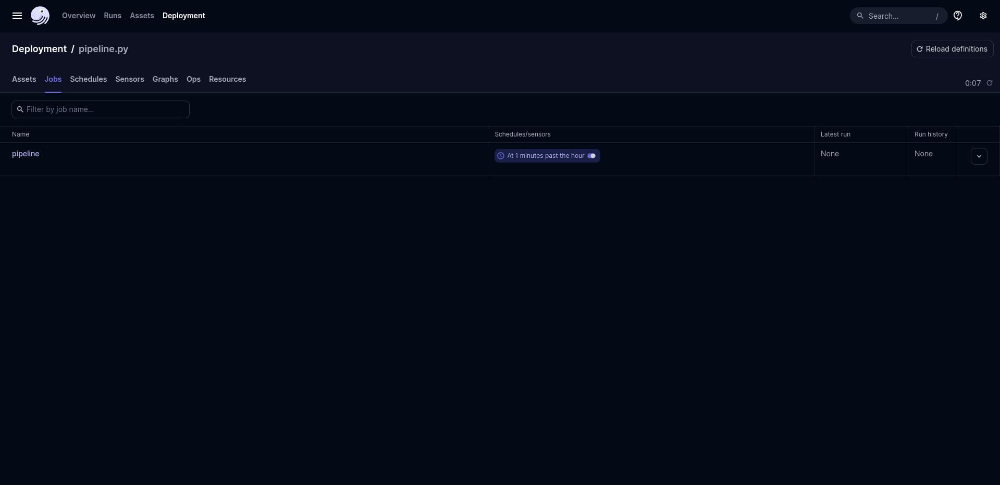

# Shipping a Data Product: From Raw Telegram Data to an Analytical API

An end-to-end data pipeline for Telegram, leveraging dbt for transformation, Dagster for orchestration, and YOLOv8 for data enrichment.

## Setup Instructions

Follow these steps to get the project up and running on your local machine.

### Prerequisites

Before you begin, ensure you have the following installed:

- Python 3.8+
    
- PostgreSQL (and a running instance accessible from your machine)
    
- `git`
    

### Clone the Repository

Open your terminal or command prompt and run:

```
git clone https://github.com/mikek1337/Shipping-a-Data-Product-From-Raw-Telegram-Data-to-an-Analytical-API-week-7.git
cd Shipping-a-Data-Product-From-Raw-Telegram-Data-to-an-Analytical-API-week-7
```

### Create and Activate a Virtual Environment

It's highly recommended to use a virtual environment to manage project dependencies:

```
python3 -m venv .venv
source .venv/bin/activate  # On Windows, use `.venv\Scripts\activate`
```

### Install Dependencies

Install all required Python packages:

```
pip install -r requirements.txt
```

### Configure Environment Variables

Create a file named `.env` in the root directory of your cloned repository. Populate it with your Telegram API credentials and PostgreSQL database connection details.

**Important:** Replace the placeholder values with your actual credentials.

```
APP_ID=YOUR_TELEGRAM_APP_ID
APP_KEY=YOUR_TELEGRAM_APP_HASH
PHONE=YOUR_PHONE_NUMBER (e.g., +1234567890)
HOST=YOUR_DB_HOST (e.g., localhost)
PASSWORD=YOUR_DB_PASSWORD
USERNAME=YOUR_DB_USERNAME
PORT=YOUR_DB_PORT (e.g., 5432)
DATABASE=YOUR_DB_NAME (e.g., raw_telegram)
```

- **Telegram API Credentials:** You can obtain `APP_ID` and `APP_KEY` by logging into [my.telegram.org](https://my.telegram.org/apps "null").
    
- **PostgreSQL:** Ensure your PostgreSQL instance is running and you have a database named `raw_telegram` (or whatever you set `DATABASE` to) where the raw and transformed data will reside.
    

### Configure Telegram Channels

Edit the `config.ini` file in the root directory to specify the Telegram channels you wish to scrape. Add channel usernames or public links under the `[channels]` section.

Example `config.ini`:

```
[channels]
channel1 = @your_channel_username_1
channel2 = https://t.me/your_channel_link_2
```

## Running the Pipeline

Follow these steps sequentially to run the entire data pipeline.

```
docker compose up
````


